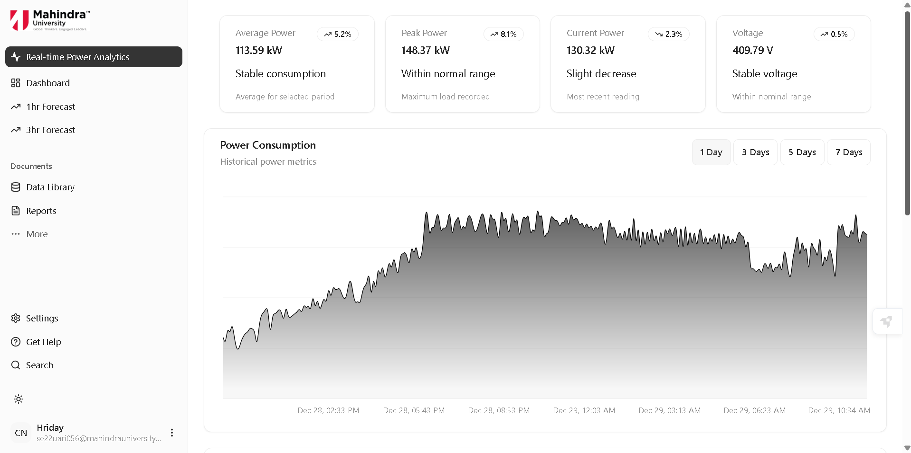
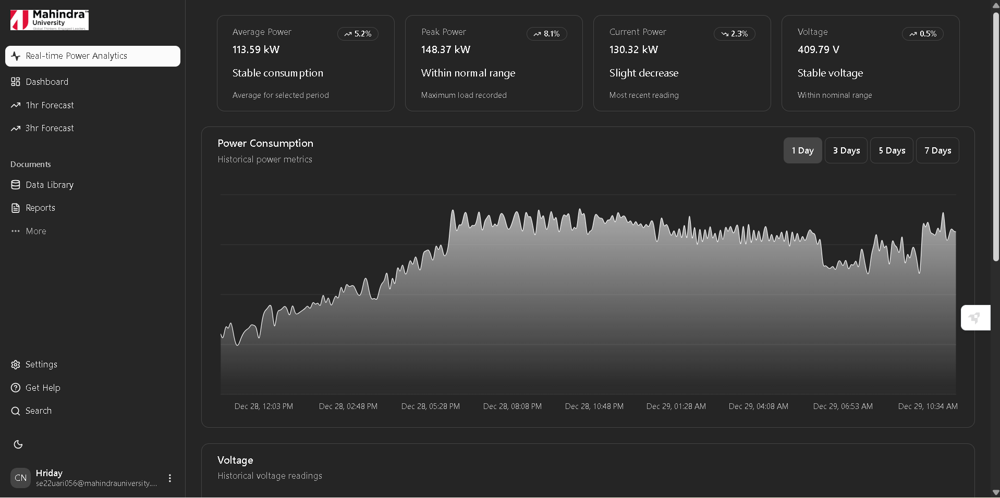
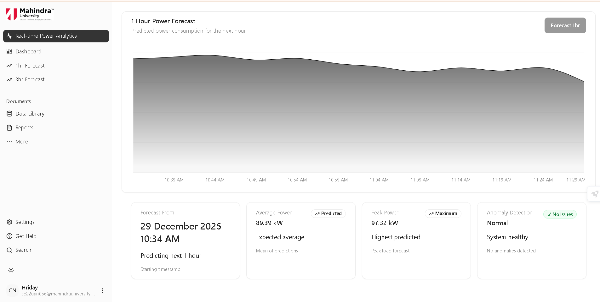
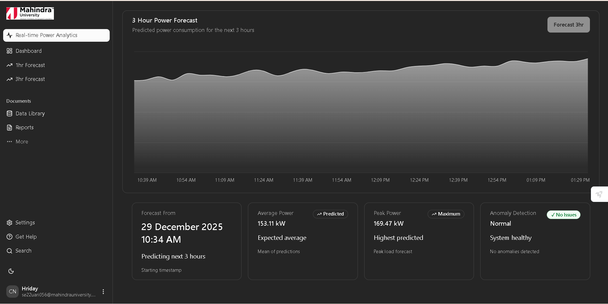

# Mahindra University Power Monitoring System

**Official Real-time Power Monitoring and Outage Forecasting Platform**

**Built for Mahindra University's Smart Campus Initiative**
---
---
## Screenshots

### Dashboard (Light Mode)

### Dashboard (Dark Mode)

### 1-Hour Forecast

### 3-Hour Forecast

---
## Overview

The **Mahindra University Power Monitoring System** is the official energy management platform for campus infrastructure, providing real-time monitoring and predictive analytics for proactive grid management.

### Purpose

**For Campus Operations:**
- Real-time dashboard with live power consumption, voltage, and electrical parameters (5-minute updates)
- Predictive forecasting: 1-hour and 3-hour ahead consumption predictions
- Automated Blackout detection for irregular power patterns and potential failures
- Historical analytics with customizable time ranges (1-7 days)

**For Sustainability:**
- Precise energy consumption tracking
- Peak usage identification for demand optimization
- Data-driven insights for cost reduction and carbon footprint management

**For Reliability:**
- Early warning system for equipment failures
- Predictive maintenance alerts
- Reduced operational downtime

---

## Key Features

**📊 Real-Time Dashboard**
- Live power, voltage, and current visualization
- Statistical summaries and trend analysis
- Dark mode support

**🔮 ML-Powered Forecasting**
- 1-hour short-term predictions 
- 3-hour extended predictions 

**⚠️ Blackout Detection**
- Real-time irregular pattern identification
- Load imbalance detection 
- Severity classification and alerts

---

## License

Academic Project - Mahindra University © 2025

---

## Acknowledgments

**Supervisor**: Dr. Neeraj Choudhary  
**Technical Support**: Mohammed Moinuddin M., Raju Vanapal Reddy V.  
**Institution**: Mahindra University, Ecole Centrale School of Engineering

---

